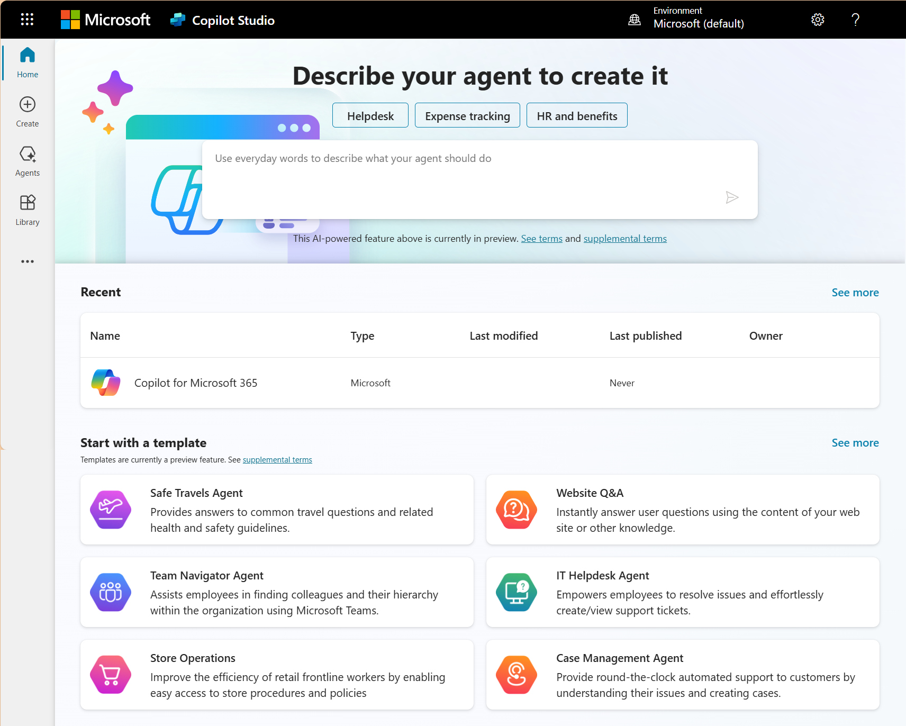

# 🚀 Desafio: Conhecendo o Microsoft Copilot Studio

Este repositório contém um resumo do aprendizado sobre **Microsoft Copilot Studio**, incluindo conceitos fundamentais e o funcionamento dos ambientes dentro da plataforma. Além disso, relato a dificuldade encontrada ao tentar criar uma conta gratuita.

## 📌 O que é o Microsoft Copilot Studio?

  

O **Microsoft Copilot Studio** é uma ferramenta que permite criar **assistentes inteligentes** (copilotos) para auxiliar em tarefas e automação de processos dentro da **Power Platform**. Com ele, é possível:
- Criar copilotos personalizados usando **modelos prontos** ou a partir de uma **descrição gerada por IA**.
- **Automatizar interações** e integrar o copiloto com sistemas da Microsoft, como **Power Automate, AI Builder e Microsoft 365**.
- Configurar **fluxos de conversação** e aprimorar a experiência do usuário com **inteligência artificial**.

## 🎯 Trabalhando com Ambientes no Microsoft Copilot Studio
Os **ambientes** no Copilot Studio são espaços isolados onde os copilotos são criados e gerenciados. Cada ambiente tem seus próprios recursos e configurações, garantindo organização e segurança no desenvolvimento.

Principais conceitos sobre ambientes:
1. **Ambiente Padrão**: Criado automaticamente para cada usuário.
2. **Ambientes Personalizados**: Permitem organizar projetos e gerenciar permissões para diferentes equipes.
3. **Ambiente de Produção vs. Teste**: É possível criar copilotos em ambientes de teste antes de disponibilizá-los em produção.

Os ambientes são essenciais para garantir que os copilotos sejam desenvolvidos de forma estruturada e possam ser testados antes da implementação final.

## ❗ Desafio Encontrado
Durante o desafio, uma das principais dificuldades foi a **impossibilidade de criar uma conta gratuita**, pois o Microsoft Copilot Studio exige um **e-mail corporativo ou de estudante** para registro. Sem essa conta, não foi possível acessar a plataforma para testar a criação de copilotos na prática.

### 🔹 Alternativa adotada:
Diante dessa limitação, explorei a **documentação oficial** e os **conteúdos teóricos disponíveis** para compreender o funcionamento da ferramenta. O estudo incluiu:
- Leitura dos guias e tutoriais fornecidos pela Microsoft.
- Análise das funcionalidades disponíveis no Copilot Studio.
- Compreensão dos tipos de copilotos que podem ser criados e sua aplicação prática.

Mesmo sem acesso à plataforma, o aprendizado teórico permitiu entender os conceitos essenciais para o uso da ferramenta.

## 🔗 Referências
- [Documentação Oficial do Copilot Studio](https://learn.microsoft.com/pt-br/microsoft-copilot-studio/)
- [Microsoft Learn - Copilot Studio](https://learn.microsoft.com/pt-br/training/modules/get-started-with-microsoft-copilot-studio/)
- [Romão's Learn](https://romaos.com.br/learn)

---
📌 *Desafio proposto pela [DIO](https://www.dio.me/).*
# Copiloto-Micrsoft-Copilot-Studio-desafio01
